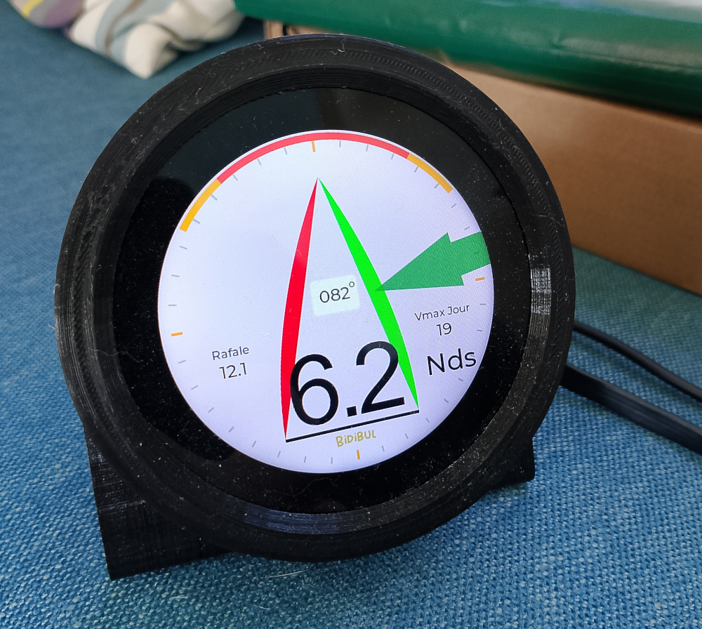

# 🌬️ Anémomètre ESP32-S3

Ce projet est avant tout un **anémomètre** basé sur un **ESP32-S3**, conçu pour les applications marines.  
Il mesure la **vitesse du vent** via un **anémomètre ultrasonique**, tout en pouvant afficher en option des données météo (pression, température).  
L’interface est réalisée avec **LVGL** sur un écran tactile couleur Waveshare.



---

## ⚙️ Fonctionnalités principales

- 🌬️ **Mesure du vent** via anémomètre ultrasonique  
- ☁️ Fonctions météo optionnelles : pression, température  
- 📡 **Connexion Wi-Fi** via passerelle  
- 📈 Graphes dynamiques colorés, défilement sur 9 h  
- 🌙 Mode nuit  
- 💾 Sauvegarde sur carte SD  
- 🧰 Surveillance mémoire & watchdog intégré  

---

## 🧰 Matériel utilisé

- 🧠 **ESP32-S3**  
- 📟 **Écran tactile couleur Waveshare 2,8ʺ (esp32-s3-touch-lcd-2.8c)**  
  - Résolution 320×240  
  - Interface SPI  
  - Tactile capacitif intégré  
  - Compatible avec LVGL  
- 💾 **Carte microSD**  
- 🌬️ **Anémomètre ultrasonique**
  - Modèle : [AliExpress – Ultrasonic Anemometer](https://fr.aliexpress.com/item/1005005491402156.html)
  - Mesure sans pièces mobiles, idéal pour usage marin
- 🌡️ **Capteur WH25** (optionnel)  
- 🌐 **Passerelle Wi-Fi externe**
  - Modèle : [AliExpress – WiFi Gateway](https://fr.aliexpress.com/item/1005006453703184.html)
  - Sert de pont réseau entre les capteurs et l’ESP32-S3
- 🔌 Alimentation 5 V / USB‑C  

---

## 📦 Anémomètre, météo & passerelle

### Anémomètre ultrasonique  
Mesure précise du vent sans entretien. Les données sont transmises à l’ESP32‑S3 pour affichage en temps réel.

### Modules météo (optionnels)  
Pression atmosphérique et température sont mesurées, affichées et enregistrées.  
Des graphes dynamiques colorés montrent les variations sur plusieurs heures.

### Passerelle Wi-Fi  
Relie l’anémomètre et les capteurs au réseau local. Permet aussi la mise à jour et la synchronisation des données.

---

## 🧭 Interface graphique (LVGL)

L’interface utilise la bibliothèque **LVGL** pour un rendu fluide et moderne :  
- Anémomètre (vent apparent)  
- Thème clair/sombre  
- Étiquettes et unités dynamiques (°C, hPa, Nds)  
- Écran tactile interactif

---

## 🚀 Installation

1. Installer l’ESP-IDF (version 5.x minimum)  
2. Cloner le dépôt dans `~/esp/projects/anemometre/`  
3. Modifier le fichier `/main/LVGL_UI/ui_events.c` avec SSID_Wifi et pasword_wifi
4. Compiler et flasher :  
   ```bash
   idf.py build
   idf.py flash
   idf.py monitor
   ```

---

## 📚 Notes

- Les fonctions météo sont optionnelles : l’anémomètre reste le cœur du projet.  
- Compatible avec les environnements embarqués marins (faible conso, écran lumineux).  
- En cours d’évolution : ajout futur du pilotage automatique Autohelm (mode vent).

---

© 2025 – Projet personnel ESP32‑S3 Bidibul.
